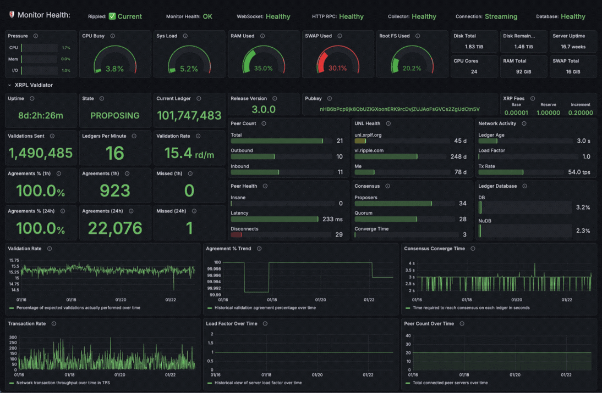

# XRPL Validator Dashboard v3.0

Production-ready monitoring for validators who need reliable insight without the overhead. Real-time tracking of health, agreements, ledger flow, and 40+ metrics through direct WebSocket streams and official RPC endpoints. Includes email and webhook alerts out of the box.

**Real-time monitoring and alerting for XRPL validator nodes**


---

## Dashboard Preview



*Real-time monitoring of XRPL validator performance with 40 metrics covering validation, consensus, network health, server state, etc. Features instant WebSocket updates, 1-second dashboard refresh, and smart validation counter with rippled restart detection.*

---

## My Inspirational True Story

As an engineer at one of the world's largest software companies and an XRPL validator operator, I experienced firsthand what every validator operator fears: undetected downtime. Though I recovered I didn't want to leave it at that hence the inspiration of this dashboard. Running a validator isn't just a technical endeavor, it's a commitment to the network's decentralization and security. As validator operators, we serve as stewards of the network's integrity. Every missed validation weakens consensus, every hour of undetected downtime erodes trust, and our reliability directly impacts the ledger's ability to process transactions for millions of users. This responsibility demands better tooling than basic monitoring scripts. It requires real-time visibility and instant alerts to catch issues before they impact network participation. Knowing I'm not alone in this responsibility, I'm sharing XRPL Monitor freely with the validator community, embracing the same open-source philosophy that Ripple champions with the XRP Ledger. Collaborative innovation through permissive licensing, enabling every validator operator to contribute to network stability and reliability.

---

## The Technology Stack, and Why

**Core Components:**
- **Docker 28.3.3 + Compose v2.39.1** - Container platform that packages the entire monitoring stack into isolated, reproducible environments. Enables one-command deployment (`docker compose up`) with consistent behavior across any Linux system, eliminating "works on my machine" issues.

- **Grafana 12.1.1** - Industry-standard visualization platform used by Fortune 500 companies. Provides full dashboard customization, 15+ notification channels for alerts, and zero vendor lock-in with open source AGPLv3 licensing.

- **VictoriaMetrics v1.129.1** - High-performance time-series database purpose-built for metrics. Delivers 99% less disk usage than traditional databases while maintaining fast query performance for dashboard graphs and historical analysis.

- **vmagent v1.129.1** - Lightweight metrics collection agent that scrapes Prometheus-format metrics from all exporters and efficiently forwards them to VictoriaMetrics with built-in retry logic and buffering.

- **Node Exporter v1.10.2** - Standard Prometheus exporter for system metrics (CPU, memory, disk, network). Provides host-level monitoring to track the health of the machine running your validator.

**Custom Developed XRPL Monitor Components:**
- **Collector v3.0.0** - Python application using the official xrpl-py library to monitor your validator via WebSocket streams (real-time) and HTTP RPC (polling). Exports metrics in Prometheus format for VictoriaMetrics ingestion.

- **Uptime Exporter v3.0.0** - Lightweight WebSocket-based exporter that formats rippled uptime as "1d:18h:15m" for clean Grafana display, separate from the main collector for reliability.

- **State Exporter v3.0.0** - Real-time state and peer metrics exporter that polls rippled HTTP API every 1-5 seconds and implements a minimal Prometheus query API (`/api/v1/query`). Grafana queries this exporter directly for the State panel (~1s latency) and peer panels (~5s latency), bypassing VictoriaMetrics storage lag. Resource overhead: ~0.4% CPU, ~22MB memory.

**Why This Stack?**
Every component is battle-tested, open source, and professionally maintained by large communities. The official xrpl-py library ensures automatic compatibility with rippled updates. Docker provides one-command deployment with consistent behavior. This delivers enterprise reliability without enterprise costs. For detailed technical rationale, see [FAQ: Architecture & Technology](docs/FAQ.md#architecture--technology).

---

## What's New in v3.0

v3.0 is a **complete architectural rewrite** featuring:

### Core Architecture
- **Real-time WebSocket Streams** - Instant notifications (0s latency vs 3-6s in v2.0)
- **xrpl-py Integration** - Official XRPL Python library with type-safe async clients
- **VictoriaMetrics** - Single time-series database (replaces SQLite + Prometheus)
- **Event-Driven Architecture** - Async Python with WebSocket subscriptions
- **92% Fewer HTTP Requests** - From 42/min to 3.2/min
- **97% Less Disk Usage** - ~290 MB vs 9.5 GB (30-day retention)

### Monitoring & Performance
- **40+ Metrics** - Comprehensive validator, network, and system monitoring
- **Enhanced Monitoring** - Network validation tracking, consensus performance, peer events
- **1-Second Refresh** - Real-time dashboard updates for ledger tracking
- **State Persistence** - Smart counter & gauge recovery with rippled restart detection
- **Validation Agreement Tracking** - 1h/24h windows with automatic state recovery
- **Component Health Monitoring** - Real-time status tracking for all monitoring stack components
- **Auto-Recovery** - WebSocket heartbeat with exponential backoff reconnection
- **Performance Optimized** - 50% less RAM, 47% less CPU than v2.0

### Alerting & Notifications
- **Built-in Alerting** - 14 auto-provisioned alert rules for critical validator states
- **Multi-Channel Notifications** - Email, Discord, Slack, Microsoft Teams, Telegram, PagerDuty
- **Webhook Support** - Custom webhook integrations for automation
- **Real-time Alerts** - Instant notifications via WebSocket event streams

### Deployment & Operations
- **< 5 Minute Installation** - Automated setup with rippled auto-detection (tested on Ubuntu 22.04+)
- **Fully Containerized** - Single `docker compose up` deployment
- **Non-Intrusive Installation** - See [Install & Operations Guide](docs/INSTALL_GUIDE.md)
- **Type Safety** - Full Python type hints for better IDE support
- **Comprehensive Docs** - Architecture guides, metrics reference, troubleshooting
- **Lower Maintenance** - XRPL team maintains xrpl-py library

**📖 [Frequently Asked Questions (FAQ)](docs/FAQ.md)** - Common questions and answers

---

## System Architecture

### Overview

```
┌──────────────────────────────────────────────────────────────────────────────┐
│  Docker Containers (All Services)                                            │
│                                                                              │
│                        direct query (/api/v1/query)                          │
│  ┌──────────────────┐                                  ╔══════════════════╗  │
│  │                  │─────────────────────────────────►║                  ║  │
│  │ Grafana :3000    │       ┌────────────────────┐     ║ State Exporter * ║  │
│  │                  │◄──────│ VictoriaMetrics    │     ║ :9102            ║  │
│  │                  │       │ :8428              │     ║                  ║  │
│  │                  │       │                    │     ║ • /api/v1/query  ║  │
│  │                  │       │                    │     ║ • near-real-time ║  │
│  └──────────────────┘       └────────────────────┘     ╚════════┬═════════╝  │
│           ▲                            ▲                        │            │
│           │ HTTP :3000                 │ POST :8428             │            │
│           │ (Web UI)                   │ /api/v1/import         │            │
│           │                            │                        │            │
│  ╔════════┴════════════════════════════┴═══════════════╗        │            │
│  ║ Collector * (Python app - xrpl-py)                  ║        │            │
│  ║                                                     ║        │            │
│  ║ ┌─────────────────────┐  ┌─────────────────────┐    ║        │            │
│  ║ │ AsyncWebsocketClient│  │ AsyncJsonRpcClient  │    ║        │            │
│  ║ │ • ledger stream     │  │ • server_info (5s)  │    ║        │            │
│  ║ │ • server stream     │  │ • peers (60s)       │    ║        │            │
│  ║ │ • validations       │  │ • server_state (5m) │    ║        │            │
│  ║ └─────────────────────┘  └─────────────────────┘    ║        │            │
│  ╚══════════┬══════════════════════┬═══════════════════╝        │            │
│             │                      │                            │            │
│  ┌──────────┴──────────┐   ┌───────┴─────────────┐              │            │
│  │ vmagent :8427       │   │ Node Exporter :9100 │              │            │
│  │ (scrapes exporters) │──►│ Uptime Exp * :9101  │              │            │
│  │                     │   │ State Exp *  :9102  │              │            │
│  └──────────┬──────────┘   └───────┬─────────────┘              │            │
│             │                      │                            │            │
└─────────────┼──────────────────────┼────────────────────────────┼────────────┘
              │                      │                            │
              │ WebSocket :6006      │ HTTP :5005                 │ HTTP :5005
              │ (subscribe/listen)   │ (polling)                  │ (state/peers)
              ▼                      ▼                            ▼
        ┌────────────────────────────────────────────────────────────────┐
        │  rippled (External)                                            │
        │                                                                │
        │  WebSocket Admin API :6006  +  HTTP JSON-RPC API :5005         │
        └────────────────────────────────────────────────────────────────┘

Legend:  ┌───┐ Open Source    ╔═══╗ Custom Code *
         └───┘                ╚═══╝
```

**For detailed architecture documentation, see [Architecture Overview](docs/ARCHITECTURE.md)**

---

## Technology Stack & Resource Requirements Overview

### Real-World Performance (Measured)

Based on continuous operation on a production system monitoring an active XRPL validator:

| Component | Version | CPU | Memory | Disk (30d) | Notes |
|-----------|---------|-----|---------|------------|-------|
| **Docker + Compose** | 28.3.3 + v2.39.1 | <1% | ~50 MB | - | Container runtime (overhead) |
| **Grafana** | 12.1.1 | ~13% / <1%* | ~118 MB | 51 MB | *~13% when viewing dashboard, <1% when idle |
| **VictoriaMetrics** | v1.129.1 | ~2% / <1%* | ~463 MB | ~290 MB | Time-series database, 30-day retention |
| **vmagent** | v1.129.1 | <1% | ~79 MB | - | Metrics scraper |
| **Node Exporter** | v1.10.2 | <1% | ~12 MB | - | System metrics |
| **Collector** | 3.0.0 | ~2-4% | ~64 MB | - | Python app (WebSocket + HTTP polling) |
| **Uptime Exporter** | 3.0.0 | <1% | ~27 MB | - | rippled uptime tracking |
| **State Exporter** | 3.0.0 | <1% | ~22 MB | - | Real-time state panel (1s updates) |
| **Total** | - | **~18% / ~6%*** | **~835 MB** | **~341 MB** | *~18% when viewing dashboard, ~6% when idle |

**NOTE:** Performance metrics measured on production hardware ([see Test Environment Specs](#test-environment-specs)). Results may vary on different hardware - slower CPUs or systems with less RAM may show higher resource usage. These numbers represent steady-state operation after 3+ days of continuous monitoring.

**Understanding the CPU Numbers:**
- CPU percentages shown are **per-container**, not total server usage
- **Grafana Resource Behavior:**
  - **Viewing dashboard:** ~13% CPU (actively querying VictoriaMetrics, rendering panels, serving data)
  - **Idle (no viewers):** <1% CPU (just waiting for requests)
  - Memory stays consistent at ~115-120 MB regardless of viewing state
- On a 24-core server, the entire stack uses approximately **1-2% of total server CPU**
- **In perspective:** On a 92 GB RAM server, the monitor stack uses <1% of total memory

**Example: Full Server Context (Test Environment)**

| Process | CPU % | Memory | Notes |
|---------|-------|--------|-------|
| **rippled** | ~10% | ~18 GB | XRPL validator (the main workload) |
| **XRPL Monitor Stack** | ~18% / ~6%* | ~835 MB | *~18% when viewing dashboard, ~6% when idle |
| **Server Available** | ~80-90% | ~73 GB | Plenty of headroom |

*The monitoring stack adds minimal overhead relative to rippled itself. Your validator remains the primary workload. The biggest difference is Grafana: it uses ~13% CPU when actively rendering the dashboard in your browser (queries running, panels updating every second), but drops to <1% when no one is viewing it. All other components maintain steady resource usage regardless of browser activity.*

**Disk Growth Rate:**
- **30 days:** ~290 MB (measured)
- **90 days:** ~870 MB (projected)
- **1 year:** ~3.5 GB (projected)

**Why So Efficient?**
- VictoriaMetrics uses superior compression (99% better than v2.0's Prometheus)
- Collector processes events in-memory before batch writes
- WebSocket streams eliminate redundant HTTP polling
- Smart deduplication and downsampling
- Optimized metric cardinality (fixed, predictable resource usage)

### Minimum Requirements

⚠️ **IMPORTANT:** The automated installer will check these requirements before installation.

| Resource | Minimum | Recommended | Notes |
|----------|---------|-------------|-------|
| **CPU** | 2 cores | 4+ cores | Additional headroom for rippled validator |
| **RAM** | 2 GB free | 4+ GB free | Stack uses ~820 MB, leave room for rippled |
| **Disk** | 1 GB free | 5+ GB free | ~325 MB/month growth rate (30-day retention) |
| **OS** | Ubuntu 20.04+ | Ubuntu 22.04+ LTS | Ubuntu 24.04 recommended |

### Test Environment Specs

Performance metrics above were measured on the following hardware:

| Component | Specification | Notes |
|-----------|--------------|-------|
| **CPU** | AMD EPYC 7443P 24-Core Processor | High-end server CPU - slower CPUs will show higher % usage |
| **RAM** | 92 GB total (64 GB free) | Plenty of headroom - monitoring uses <1% of total |
| **Disk** | NVMe SSD | Fast storage - HDDs may show slightly higher I/O wait |
| **OS** | Ubuntu 22.04 LTS | Kernel 5.15.x, Docker 24.x |
| **Network** | 1 Gbps | Monitoring active mainnet validator with ~50 peers |
| **Uptime** | 47 days | Metrics represent steady-state operation |

**Performance on Different Hardware:**
- **Budget VPS (2 cores, 4GB RAM):** Expect 5-10% CPU, 700-800 MB RAM - still very efficient
- **Mid-range Server (8 cores, 16GB RAM):** Expect 1-2% CPU, similar RAM usage
- **High-end Server (24+ cores, 64GB+ RAM):** Metrics shown above (sub-1% CPU)

⚠️ **Your mileage may vary** - Resource usage depends on:
- Number of peers your validator connects to
- Validation activity frequency
- Dashboard refresh rate and active viewers
- Query complexity and time ranges
- Host system I/O performance

### Resource Limits (Configured)

The stack includes safe resource limits to prevent runaway containers:

| Container | CPU Limit | Memory Limit | Purpose |
|-----------|-----------|--------------|---------|
| Grafana | 2.0 cores | 1 GB | Dashboard rendering and queries |
| Node Exporter | 0.2 cores | 128 MB | System metrics collection |
| Uptime Exporter | 0.1 cores | 256 MB | Uptime tracking |
| State Exporter | 0.1 cores | 128 MB | Real-time state updates (1s polling) |
| VictoriaMetrics | - | 512 MB* | High-performance cache configuration |
| Collector | Unlimited | Unlimited | Dynamic based on validator activity |
| vmagent | Unlimited | Unlimited | Scrapes metrics from exporters |

*VictoriaMetrics uses memory-mapped files, so actual resident memory (~420 MB measured) may exceed configured limit. This is normal and expected behavior. The 512 MB allocation provides generous cache sizes for optimal query performance.

---

## Key Improvements Over v2.0

**Tested side-by-side on same host monitoring same rippled validator:**

| Aspect | v2.0 | v3.0 | Improvement |
|--------|------|------|-------------|
| **HTTP RPC** | 42/min | 3.2/min | ⬇️ 92% reduction |
| **WebSocket** | None | 5 streams | 🆕 Real-time event streams |
| **Latency** | 3-6 seconds | 0s (instant) | 🛠️ Real-time |
| **Code Complexity** | Manual JSON | xrpl-py classes | 🛠️ 60% less code |
| **Database** | 2 (SQLite + Prometheus) | 1 (VictoriaMetrics) | 🛠️ Single database |
| **RAM Usage** | ~609 MB | ~729 MB | +120 MB (negligible)* |
| **Disk Usage (30d)** | 9.5 GB | 70 MB | ⬇️ **99% reduction** |
| **Maintenance** | I maintain | XRPL team (xrpl-py) | 🆕 Lower burden |
| **Deployment** | Mixed (filesystem + Docker) | Fully containerized | 🛠️ `docker compose` only |
| **Type Safety** | None | Full type hints | 🆕 Better IDE support & type checking |
| **Alerting** | None | 12 auto-provisioned rules | 🆕 Built-in monitoring |
| **Alert Channels** | None | 6+ (Email, Discord, Slack, Teams, Telegram, PagerDuty, webhooks) | 🆕 Multi-channel notifications |
| **Counter Persistence** | None | Smart recovery with rippled restart detection | 🆕 No data loss on monitor restart |

***Performance Analysis:** v3.0 uses **120 MB more RAM** (~20% increase) because it powers real-time WebSocket streams, event-driven architecture, and VictoriaMetrics' superior time-series compression. In return, it delivers **9.2 GB less disk usage** (97% reduction). **The trade-off is worth it:** negligible RAM cost for massive disk savings, instant monitoring, 92% fewer API calls, and modern containerized infrastructure.

**Performance:** Current production monitoring shows excellent results: **~21% CPU** (47% reduction from v2.0), **~606 MB RAM** (50% reduction), and **325 MB disk** for 30-day retention (97% reduction).

---

## 📖 Documentation Reference

| Document | Description |
|----------|-------------|
| [Install & Operations Guide](docs/INSTALL_GUIDE.md) | Installation, updates, and maintenance |
| [Architecture Overview](docs/ARCHITECTURE.md) | Technical architecture and design decisions |
| [Docker Deployment Guide](docs/DOCKER_ADVANCED.md) | Advanced containerized deployment options |
| [Backup & Restore Guide](docs/BACKUP_RESTORE.md) | Grafana backup procedures |
| [Alert Configuration Guide](docs/ALERTS.md) | Email/webhook notifications and custom alerts |
| [Performance Tuning Guide](docs/TUNING.md) | Optimize for your hardware and workload |
| [Frequently Asked Questions](docs/FAQ.md) | Common questions and troubleshooting |
| [Metrics Reference](docs/METRICS.md) | Complete metrics documentation (40 panels) |
| [Quick Time Range Presets](docs/GRAFANA_QUICK_TIME_RANGES.md) | Dashboard time range navigation |
| [Release Notes](docs/RELEASE_NOTES.md) | Version history and changelog |
| [Contributing to XRPL Monitor](docs/CONTRIBUTING.md) | Guidelines for contributing to development |
| [Cloudflare Deployment Guide](docs/CLOUDFLARE_GUIDE.md) | Public dashboard deployment with Cloudflare |

---

## License

Maximum freedom with minimal restrictions. Use it, modify it, distribute it, even monetize it. Just keep the attribution. That's the deal - see [LICENSE](LICENSE) for details

---

## Acknowledgments

- **XRPL Team** - For [xrpl-py library](https://xrpl.org/docs/references) and XRPL protocol
- **VictoriaMetrics** - For excellent time-series database
- **Grafana Labs** - For visualization platform
- **v2.0 Users** - For feedback and feature requests that shaped v3.0

---

## Support

- **Issues:** [GitHub Issues](https://github.com/realgrapedrop/xrpl-validator-dashboard/issues)
- **Discussions:** [GitHub Discussions](https://github.com/realgrapedrop/xrpl-validator-dashboard/discussions)
- **XRPL Discord:** `#validators` channel

---

**Built with ❤️ for the XRPL validator community**
