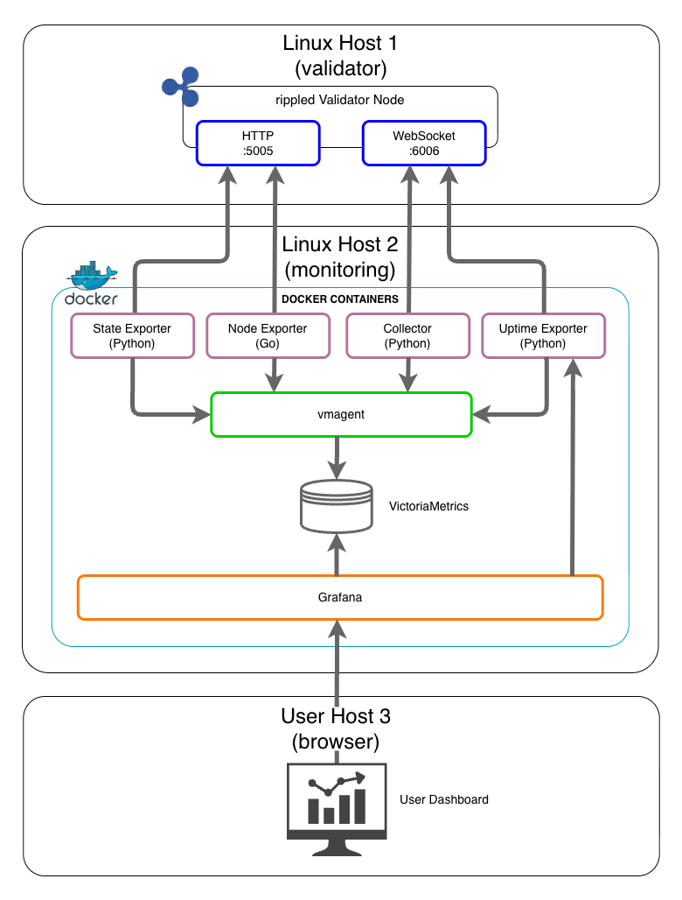

# **__HARDENED ARCHITECTURE GUIDE__**

*Separate monitoring from your validator for maximum security.*

---

# Table of Contents

- [Overview](#overview)
- [Why Separate Hosts?](#why-separate-hosts)
- [Architecture Diagram](#architecture-diagram)
- [Network Requirements](#network-requirements)
- [Host 1: Validator Configuration](#host-1-validator-configuration)
- [Host 2: Monitoring Configuration](#host-2-monitoring-configuration)
- [Firewall Rules](#firewall-rules)
- [Advanced: VLAN Isolation](#advanced-vlan-isolation)
- [Installation Steps](#installation-steps)
- [Verification](#verification)
- [Security Checklist](#security-checklist)

---

# Overview

This guide describes a hardened deployment where the XRPL validator and monitoring stack run on separate hosts. This architecture eliminates Docker from the validator host, reducing attack surface and following [XRPL security best practices](https://xrpl.org/docs/infrastructure/configuration/server-modes/run-rippled-as-a-validator).

---

# Why Separate Hosts?

**Docker on validator host introduces risk:**

| Risk | Description | Mitigation |
|------|-------------|------------|
| **Root daemon** | Docker daemon runs as root; compromise = full host access | Eliminate Docker from validator |
| **Container escape** | CVEs allow breaking out of containers | No containers on validator |
| **Shared resources** | Containers compete with rippled for CPU/memory | Dedicated validator resources |
| **Attack surface** | Each container is a potential entry point | Minimal software on validator |
| **Socket exposure** | `/var/run/docker.sock` grants root-equivalent access | No socket on validator |

**XRPL Foundation recommends:**
> "Validating nodes must run on bare metal or dedicated servers... Run minimal software on rippled nodes. Do not install web, email, or other server software on rippled nodes."

---

# Architecture Diagram



### Detailed Network Topology

```
┌─────────────────────────────────────────────────────────────────────────────────┐
│                       INFRASTRUCTURE LAN (10.0.0.0/24)                          │
│                                                                                 │
│  ┌─────────────────────────────┐      ┌─────────────────────────────────────┐   │
│  │     HOST 1: VALIDATOR       │      │        HOST 2: MONITORING           │   │
│  │     10.0.0.10               │      │        10.0.0.20                    │   │
│  │     (No Docker)             │      │        (Docker Stack)               │   │
│  │                             │      │                                     │   │
│  │  ┌───────────────────────┐  │      │   ┌─────────────────────────────┐   │   │
│  │  │       rippled         │  │      │   │  Collector                  │   │   │
│  │  │                       │  │      │   │  Uptime Exporter            │   │   │
│  │  │  • Validator key      │  │      │   └──────────────┬──────────────┘   │   │
│  │  │  • Peer port 51235    │  │      │                  │ WS :6006         │   │
│  │  │  • Admin WS 6006      │◄─┼──────┼──────────────────┘                  │   │
│  │  │  • Admin HTTP 5005    │◄─┼──────┼──────────────────┐                  │   │
│  │  └───────────────────────┘  │      │                  │ HTTP :5005       │   │
│  │                             │      │   ┌──────────────┴──────────────┐   │   │
│  │  Firewall:                  │      │   │  State Exporter             │   │   │
│  │  • Allow Host 2 → 5005,6006 │      │   │  Node Exporter              │   │   │
│  │  • Allow Internet → 51235   │      │   └─────────────────────────────┘   │   │
│  └─────────────────────────────┘      │                                     │   │
│                                       │   ┌─────────────────────────────┐   │   │
│                                       │   │  VictoriaMetrics            │   │   │
│                                       │   │  vmagent                    │   │   │
│                                       │   └─────────────────────────────┘   │   │
│                                       │                                     │   │
│                                       │   ┌─────────────────────────────┐   │   │
│                                       │   │  Grafana (:3000)            │   │   │
│                                       │   └─────────────────────────────┘   │   │
│                                       │                                     │   │
│                                       │   Firewall:                         │   │
│                                       │   • Allow Host 3 → 3000             │   │
│                                       └──────────────────┬──────────────────┘   │
│                                                          │                      │
│                                                          │ :3000                │
│                                                          │                      │
│  ┌───────────────────────────────────────────────────────┴──────────────────┐   │
│  │                      HOST 3: USER WORKSTATION                            │   │
│  │                      10.0.0.30                                           │   │
│  │                                                                          │   │
│  │   • Web browser accessing Grafana dashboard (http://10.0.0.20:3000)      │   │
│  │   • SSH access to Host 1 and Host 2 for administration                   │   │
│  └──────────────────────────────────────────────────────────────────────────┘   │
│                                                                                 │
└─────────────────────────────────────────────────────────────────────────────────┘
```

**Key Points:**
- All three hosts are on the same private LAN (10.0.0.0/24)
- Host firewalls restrict access between hosts (defense in depth)
- Host 1 only allows Host 2 to access admin ports (5005, 6006)
- Host 2 only allows Host 3 to access Grafana (port 3000)
- For additional isolation, see [Advanced: VLAN Isolation](#advanced-vlan-isolation)

---

# Network Requirements

### Host 1: Validator Ports

| Port | Component | Purpose | Exposed To | Notes |
|------|-----------|---------|------------|-------|
| 5005 | rippled | Admin HTTP API | Host 2 only | RPC calls for monitor |
| 5006 | rippled | Public WebSocket API | **Disabled** | Validators should not serve public API; disable or remove from rippled.cfg |
| 6006 | rippled | Admin WebSocket API | Host 2 only | Real-time streams for monitor |
| 51235 | rippled | XRPL peer protocol | Public (Internet) | Required for network participation |

### Host 2: Monitor Ports

| Port | Component | Purpose | Exposed To | Notes |
|------|-----------|---------|------------|-------|
| 3000 | Grafana | Dashboard UI | Your IP only | Or use Cloudflare Tunnel |
| 8428 | VictoriaMetrics | Time-series database | localhost only | Internal metrics storage |
| 8427 | vmagent | Metrics scraper | localhost only | Scrapes exporters |
| 8090 | Collector | XRPL metrics collector | localhost only | Connects to rippled on Host 1 |
| 9100 | Node Exporter | System metrics | localhost only | Host 2 system stats |
| 9101 | Uptime Exporter | rippled uptime | localhost only | Formats uptime display |
| 9102 | State Exporter | Real-time state | localhost only | 1-second state updates |

### Host 3: User Workstation (10.0.0.30)

| Port | Component | Purpose | Connects To | Notes |
|------|-----------|---------|-------------|-------|
| - | Web Browser | Grafana dashboard | Host 2:3000 | Or use Cloudflare Tunnel for remote access |
| - | SSH Client | Administration | Host 1:22, Host 2:22 | Key-based authentication only |

**Note:** In this base setup, all hosts are on the same LAN. Host-level firewalls provide security between hosts. For additional network-level isolation, see [Advanced: VLAN Isolation](#advanced-vlan-isolation).

---

# Host 1: Validator Configuration

**In This Section:**
- [rippled.cfg Changes](#rippledcfg-changes)
- [Secure Configuration File](#secure-configuration-file)

---

### rippled.cfg Changes

Bind admin ports to private interface only (not 0.0.0.0).

**Understanding the `ip` and `admin` parameters:**

| Parameter | Purpose | Security Function |
|-----------|---------|-------------------|
| `ip` | Interface binding | Controls which network interface the port listens on. Setting to a private IP prevents connections from other interfaces (e.g., public internet). Using `0.0.0.0` binds to ALL interfaces (insecure for admin ports). |
| `admin` | Admin whitelist | IP addresses allowed to execute admin commands. Acts as an application-level whitelist. Only connections from these IPs can run privileged commands like `stop`, `peers`, `validation_seed`, etc. |

**Example: Hardened admin ports**

```ini
# In rippled.cfg

[port_ws_admin_local]
port = 6006
ip = 10.0.0.10           # Bind to private interface only (NOT 0.0.0.0)
admin = 10.0.0.10        # Whitelist: only this IP can run admin commands
protocol = ws

[port_rpc_admin_local]
port = 5005
ip = 10.0.0.10           # Bind to private interface only (NOT 0.0.0.0)
admin = 10.0.0.10        # Whitelist: only this IP can run admin commands
protocol = http
```

**Replace `10.0.0.10` with your validator's private LAN IP.**

**Why both `ip` and `admin`?**
- `ip` is network-level: determines what connections are physically possible
- `admin` is application-level: determines what connections can run privileged commands
- Together they provide defense-in-depth: even if someone reaches the port, they can't run admin commands unless whitelisted

### Secure Configuration File

```bash
chmod 600 /etc/opt/ripple/rippled.cfg
chown rippled:rippled /etc/opt/ripple/rippled.cfg
```

---

# Host 2: Monitoring Configuration

**In This Section:**
- [.env Configuration](#env-configuration)
- [Disabled Features](#disabled-features-acceptable-trade-offs)

---

### .env Configuration

```bash
# Point to validator host's private IP
RIPPLED_WS_URL=ws://10.0.0.10:6006
RIPPLED_HTTP_URL=http://10.0.0.10:5005

# No Docker container access (rippled not in Docker)
# Leave RIPPLED_DOCKER_CONTAINER unset

# No local rippled data directory
# Leave RIPPLED_DATA_PATH unset (disables NuDB metrics)

VALIDATOR_PUBLIC_KEY=nHYourValidatorPublicKeyHere
```

### Disabled Features (Acceptable Trade-offs)

| Feature | Reason | Impact |
|---------|--------|--------|
| NuDB size metrics | No access to rippled data directory | Minor - ledger sequence still tracked |
| Docker exec fallback | rippled not in Docker | None if admin API is accessible |

---

# Firewall Rules

**In This Section:**
- [Host 1 (Validator) - iptables](#host-1-validator---iptables)
- [Host 1 (Validator) - UFW Alternative](#host-1-validator---ufw-alternative)
- [Host 2 (Monitoring) - UFW](#host-2-monitoring---ufw)

---

### Host 1 (Validator) - iptables

```bash
# Allow SSH from your management IP
iptables -A INPUT -p tcp --dport 22 -s YOUR_MGMT_IP -j ACCEPT

# Allow XRPL peer protocol (public)
iptables -A INPUT -p tcp --dport 51235 -j ACCEPT

# Allow admin ports ONLY from monitoring host
iptables -A INPUT -p tcp --dport 5005 -s 10.0.0.20 -j ACCEPT
iptables -A INPUT -p tcp --dport 6006 -s 10.0.0.20 -j ACCEPT

# Drop all other inbound
iptables -A INPUT -m state --state ESTABLISHED,RELATED -j ACCEPT
iptables -A INPUT -i lo -j ACCEPT
iptables -A INPUT -j DROP
```

**Replace `10.0.0.20` with your monitoring host's private IP.**

### Host 1 (Validator) - UFW Alternative

```bash
# Reset and set defaults
sudo ufw reset
sudo ufw default deny incoming
sudo ufw default allow outgoing

# Allow SSH
sudo ufw allow from YOUR_MGMT_IP to any port 22

# Allow XRPL peers
sudo ufw allow 51235/tcp

# Allow admin ONLY from monitoring host
sudo ufw allow from 10.0.0.20 to any port 5005
sudo ufw allow from 10.0.0.20 to any port 6006

sudo ufw enable
```

### Host 2 (Monitoring) - UFW

```bash
sudo ufw default deny incoming
sudo ufw default allow outgoing

# Allow SSH from Host 3 (user workstation)
sudo ufw allow from 10.0.0.30 to any port 22

# Allow Grafana from Host 3 only
sudo ufw allow from 10.0.0.30 to any port 3000

sudo ufw enable
```

**Replace `10.0.0.30` with your workstation's IP address.**

---

# Advanced: VLAN Isolation

For maximum security, place the validator and monitoring hosts in an isolated VLAN, separate from your management workstation. This provides network-level isolation in addition to host-level firewalls.

### Detailed VLAN Network Topology

```
┌─────────────────────────────────────────────────────────────────────────────────┐
│                       VLAN 10: MANAGEMENT (192.168.10.0/24)                     │
│                                                                                 │
│  ┌──────────────────────────────────────────────────────────────────────────┐   │
│  │                      HOST 3: USER WORKSTATION                            │   │
│  │                      192.168.10.50                                       │   │
│  │                                                                          │   │
│  │   • Web browser accessing Grafana dashboard                              │   │
│  │   • SSH access to Host 1 and Host 2 for administration                   │   │
│  └──────────────────────────────────────────────────────────────────────────┘   │
│                                                                                 │
└─────────────────────────────────────┬───────────────────────────────────────────┘
                                      │
                                      │ :22 (SSH), :3000 (Grafana)
                                      ▼
┌─────────────────────────────────────────────────────────────────────────────────┐
│                           ROUTER / FIREWALL                                     │
│                       (Inter-VLAN routing rules)                                │
│                                                                                 │
│   • Allow Host 3 → Host 1:22, Host 2:22 (SSH)                                   │
│   • Allow Host 3 → Host 2:3000 (Grafana)                                        │
│   • Allow Host 2 → Host 1:5005, 6006 (rippled admin)                            │
│   • Allow Host 1 → Internet:51235, 443 (XRPL peers, UNL updates)                │
│   • Block all other inter-VLAN traffic                                          │
└─────────────────────────────────────┬───────────────────────────────────────────┘
                                      │
       ┌─────────────────┐            │
       │    INTERNET     │            │ :5005, :6006 (rippled admin)
       └─────────────────┘            │
                ▲                     │
                │ :51235              ▼
┌───────────────┼─────────────────────────────────────────────────────────────────┐
│               │       VLAN 20: INFRASTRUCTURE (10.20.0.0/24)                    │
│               │                                                                 │
│  ┌────────────┴────────────────┐      ┌─────────────────────────────────────┐   │
│  │     HOST 1: VALIDATOR       │      │        HOST 2: MONITORING           │   │
│  │     10.20.0.10              │      │        10.20.0.20                   │   │
│  │     (No Docker)             │      │        (Docker Stack)               │   │
│  │                             │      │                                     │   │
│  │  ┌───────────────────────┐  │      │   ┌─────────────────────────────┐   │   │
│  │  │       rippled         │  │      │   │  Collector                  │   │   │
│  │  │                       │  │      │   │  Uptime Exporter            │   │   │
│  │  │  • Validator key      │  │      │   └──────────────┬──────────────┘   │   │
│  │  │  • Peer port 51235    │  │      │                  │ WS :6006         │   │
│  │  │  • Admin WS 6006      │◄─┼──────┼──────────────────┘                  │   │
│  │  │  • Admin HTTP 5005    │◄─┼──────┼──────────────────┐                  │   │
│  │  └───────────────────────┘  │      │                  │ HTTP :5005       │   │
│  │                             │      │   ┌──────────────┴──────────────┐   │   │
│  │  Firewall:                  │      │   │  State Exporter             │   │   │
│  │  • Allow Host 2 → 5005,6006 │      │   │  Node Exporter              │   │   │
│  │  • Allow Internet → 51235   │      │   └─────────────────────────────┘   │   │
│  │                             │      │                                     │   │
│  └─────────────────────────────┘      │   ┌─────────────────────────────┐   │   │
│                                       │   │  VictoriaMetrics            │   │   │
│                                       │   │  vmagent                    │   │   │
│                                       │   └─────────────────────────────┘   │   │
│                                       │                                     │   │
│                                       │   ┌─────────────────────────────┐   │   │
│                                       │   │  Grafana (:3000)            │   │   │
│                                       │   └──────────────┬──────────────┘   │   │
│                                       │                  │                  │   │
│                                       │   Firewall:      │ :3000            │   │
│                                       │   • Allow VLAN 10 → 3000            │   │
│                                       └──────────────────┼──────────────────┘   │
│                                                          │                      │
│                                                          │ (via Router)         │
│                                                          └──► To Host 3         │
│                                                                                 │
└─────────────────────────────────────────────────────────────────────────────────┘
```

**Key Differences from Base Setup:**
- Host 3 is on a **separate VLAN** (192.168.10.0/24) from infrastructure
- All traffic between VLANs goes through **router/firewall**
- Inter-VLAN traffic is **logged and auditable**
- If Host 2 is compromised, attacker **cannot reach Host 3** (different network segment)

### Inter-VLAN Firewall Rules

Configure your router/firewall to allow only these flows:

| Source | Destination | Port | Purpose |
|--------|-------------|------|---------|
| 192.168.10.50 (Workstation) | 10.20.0.10 | 22 | SSH to validator |
| 192.168.10.50 (Workstation) | 10.20.0.20 | 22 | SSH to monitor |
| 192.168.10.50 (Workstation) | 10.20.0.20 | 3000 | Grafana dashboard |
| 10.20.0.20 (Monitor) | 10.20.0.10 | 5005 | rippled HTTP admin |
| 10.20.0.20 (Monitor) | 10.20.0.10 | 6006 | rippled WebSocket admin |
| 10.20.0.10 (Validator) | Internet | 51235 | XRPL peer protocol |
| 10.20.0.10 (Validator) | Internet | 443 | UNL list updates (vl.xrplf.org) |

**Block everything else.**

### Benefits of VLAN Isolation

| Benefit | Description |
|---------|-------------|
| **Blast radius containment** | Compromised monitor can't reach your workstation or other networks |
| **No lateral movement** | Attacker trapped in infrastructure VLAN |
| **Audit trail** | All inter-VLAN traffic logged at firewall |
| **Separation of duties** | Infrastructure isolated from management network |
| **Defense in depth** | Multiple layers: host firewall + VLAN firewall + network segmentation |

### Example: pfSense/OPNsense Rules

```
# VLAN 10 (Management) → VLAN 20 (Infrastructure)
pass in on VLAN10 proto tcp from 192.168.10.50 to 10.20.0.10 port 22
pass in on VLAN10 proto tcp from 192.168.10.50 to 10.20.0.20 port {22, 3000}
block in on VLAN10 to 10.20.0.0/24

# VLAN 20 (Infrastructure) internal
pass in on VLAN20 proto tcp from 10.20.0.20 to 10.20.0.10 port {5005, 6006}
block in on VLAN20 proto tcp from 10.20.0.10 to 10.20.0.20

# VLAN 20 → Internet (validator only)
pass out on WAN proto tcp from 10.20.0.10 to any port {51235, 443}
block out on WAN from 10.20.0.20 to any
```

### Alternative: VPN Access

Instead of whitelisting your workstation IP, use a VPN:

1. **WireGuard/OpenVPN server** on your router or a dedicated host
2. **VPN clients** connect from anywhere (home, mobile, etc.)
3. **VPN subnet** (e.g., 192.168.10.0/24) has access to infrastructure VLAN
4. **No direct internet exposure** of Grafana

This allows secure access from anywhere without exposing port 3000 publicly.

---

# Installation Steps

### Prerequisites

Before installing, verify network connectivity from Host 2 (Monitor) to Host 1 (Validator):

```bash
# Test HTTP admin port
curl -s -X POST http://10.0.0.10:5005 \
  -H "Content-Type: application/json" \
  -d '{"method": "server_info"}' | jq '.result.info.server_state'

# Test WebSocket admin port (requires wscat: npm install -g wscat)
wscat -c ws://10.0.0.10:6006 -x '{"command": "ping"}'
```

**If connections fail:**
- Verify Host 1 firewall allows Host 2's IP to ports 5005 and 6006
- Verify rippled.cfg `ip` parameter is set to Host 1's private IP (not 127.0.0.1)
- Verify rippled is running: `systemctl status rippled`

### On Host 2 (Monitoring)

1. **Clone repository:**
   ```bash
   git clone https://github.com/realgrapedrop/xrpl-validator-dashboard.git
   cd xrpl-validator-dashboard
   ```

2. **Run installer:**
   ```bash
   ./install.sh
   ```

3. **When prompted for rippled connection:**
   - Select "Remote rippled (different host)"
   - Enter validator's private IP: `10.0.0.10`
   - Enter WebSocket port: `6006`
   - Enter HTTP port: `5005`

The installer will automatically build and start all containers.

---

# Verification

**Replace `10.0.0.10` with your validator's private IP in the examples below.**

**In This Section:**
- [Test Connectivity](#test-connectivity-from-host-2)
- [Verify Firewall Blocks](#verify-firewall-blocks-unauthorized-access)
- [Verify Metrics](#verify-metrics-flowing)

---

### Test Connectivity from Host 2

```bash
# Test HTTP admin access
curl -s -X POST http://10.0.0.10:5005 \
  -H "Content-Type: application/json" \
  -d '{"method": "server_info"}' | jq '.result.info.server_state'

# Test WebSocket (requires wscat)
wscat -c ws://10.0.0.10:6006 -x '{"command": "server_info"}'
```

### Verify Firewall Blocks Unauthorized Access

```bash
# From a third host (should timeout/fail)
curl --connect-timeout 5 http://10.0.0.10:5005
# Expected: Connection refused or timeout
```

### Verify Metrics Flowing

```bash
# On Host 2
curl -s "http://localhost:8428/api/v1/query?query=xrpl_ledger_sequence" | jq '.data.result[0].value[1]'
```

---

# Security Checklist

### Host 1 (Validator)

- [ ] No Docker installed
- [ ] rippled admin ports bound to private IP only
- [ ] Firewall allows admin ports only from Host 2
- [ ] `rippled.cfg` permissions are 0600
- [ ] `[peer_private]` set to 1 (optional, for enhanced privacy)
- [ ] SSH key-only authentication (no passwords)
- [ ] Fail2ban installed and configured
- [ ] Automatic security updates enabled

### Host 2 (Monitoring)

- [ ] Docker installed with non-root user in docker group
- [ ] `.env` configured with validator's private IP
- [ ] Grafana password changed from default
- [ ] Firewall restricts Grafana access to Host 3 IP only
- [ ] No public exposure of VictoriaMetrics (port 8428)
- [ ] SSH key-only authentication
- [ ] Automatic security updates enabled

### Host 3 (User Workstation)

- [ ] On same LAN as Host 1 and Host 2 (10.0.0.0/24)
- [ ] SSH keys configured for Host 1 and Host 2 access
- [ ] Browser bookmarked to Grafana URL (http://10.0.0.20:3000)
- [ ] VPN configured (if accessing remotely)

### Network

- [ ] All hosts on same private LAN (10.0.0.0/24)
- [ ] No admin ports exposed to public internet
- [ ] Host-level firewalls configured:
  - [ ] Host 1: Allow Host 2 → 5005, 6006
  - [ ] Host 2: Allow Host 3 → 3000
  - [ ] All hosts: Allow SSH from Host 3
- [ ] (Optional) VLAN isolation for additional security - see [Advanced: VLAN Isolation](#advanced-vlan-isolation)

---

**Sources:**
- [Run rippled as a Validator - XRPL.org](https://xrpl.org/docs/infrastructure/configuration/server-modes/run-rippled-as-a-validator)
- [15 Best Practices for Validator Node Security - Medium](https://medium.com/protofire-blog/15-best-practices-for-validator-node-security-5d396a636720)
- [Securing Prometheus and Grafana - DoHost](https://dohost.us/index.php/2025/09/28/securing-your-prometheus-and-grafana-installations/)
- [Prometheus Security Best Practices - CompileNRun](https://www.compilenrun.com/docs/observability/prometheus/prometheus-best-practices/security-and-authentication/)

---

**Last Updated:** December 2025
